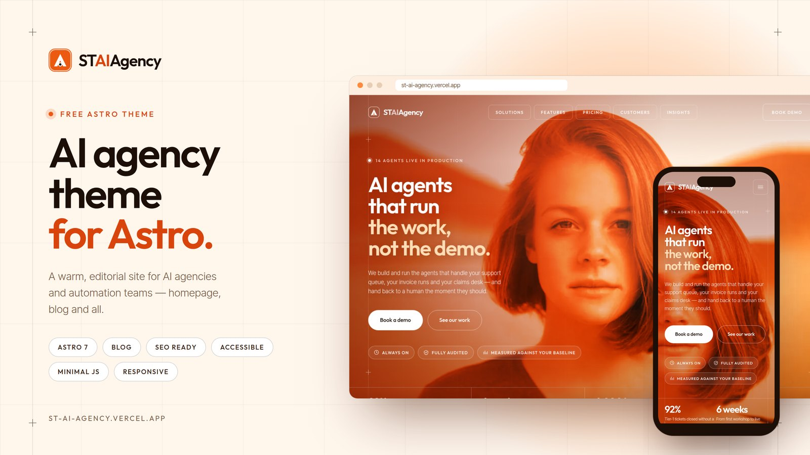

# ST AI Agency

**ST AI Agency** is a free Astro AI agency theme for AI agencies, AI automation studios, AI consultancies and AI agent platforms. It has a warm orange, cream and dark-brown design, a single-page homepage with a section for each topic, and a full Markdown blog. It ships almost no JavaScript.

> *AI agents that run the work, not the demo.*



## Demo

**Live demo:** [st-ai-agency.vercel.app](https://st-ai-agency.vercel.app/)

## Features

- **Astro 7** with static output and no UI framework.
- **AI agency design.** A full-bleed hero that tints its photo in the brand colours, editorial service rows, a heat-gradient process band, dark customer cards and arched portraits.
- **Responsive layout** at every width, with a mobile menu below 1200px.
- **One homepage with a section for each topic.** Hero, client strip, AI solutions, platform/features, process, customer results, statistics, industry sectors, testimonial, team, pricing, insights preview, FAQ, contact form and a call-to-action band.
- **Blog** built on Astro Content Collections (Content Layer `glob` loader). Each post gets its own page with breadcrumbs, author, date, reading time, tags, previous/next links and related posts.
- **Blog index** with a featured post and a category filter. The filter is a progressive enhancement and the page works without JavaScript.
- **SEO.** Canonical URLs, Open Graph and Twitter/X cards, JSON-LD (`Organization`, `WebSite`, `BlogPosting`, `BreadcrumbList`), a sitemap, `robots.txt` and an RSS feed.
- **Accessibility**
  - Skip link and semantic landmarks.
  - Accessible mobile dialog: focus trap, Escape to close, focus returned to the menu button.
  - FAQ accordion with `aria-expanded`.
  - `aria-current` on real page links only.
  - Visible focus states.
  - Reduced-motion support.
  - Content stays fully readable with JavaScript disabled.
- **Lightweight JavaScript.** About 3 KB of minified vanilla JavaScript per page, inlined by Astro. No framework runtime and no third-party scripts.
- **Easy to customise.** One site config file plus typed data files for every homepage section.
- **Self-hosted fonts** (Outfit and Inter Tight) with no third-party font requests.
- **Optimised local images.** WebP files with explicit dimensions. The hero is preloaded and images further down the page are lazy-loaded.
- **Static form UI** that is honest about being a demo until you connect a provider (Formspree, Netlify Forms, Web3Forms or your own API).
- **Sub-path deploys.** Works at a domain root or under a sub-path, such as a GitHub Pages project site.

## Tech stack

| Tool | Purpose |
| --- | --- |
| [Astro](https://astro.build) 7 | Static site generator, components, content collections |
| [@astrojs/sitemap](https://docs.astro.build/en/guides/integrations-guide/sitemap/) | Generates `sitemap-index.xml` |
| [@astrojs/rss](https://docs.astro.build/en/recipes/rss/) | Generates `rss.xml` for the blog |
| [@fontsource-variable/outfit](https://fontsource.org/fonts/outfit) & [inter-tight](https://fontsource.org/fonts/inter-tight) | Self-hosted variable fonts |
| TypeScript | Typed config, data and scripts |
| Plain CSS | Design tokens and component styles (no Tailwind) |
| Vanilla TypeScript | Header, mobile menu, reveal, FAQ, forms |

Dev-only: `@astrojs/check` and `typescript` for `npm run check`.

## Requirements

- **Node.js 22.12.0 or newer.** This is the minimum for Astro 7. An `.nvmrc` file is included.
- npm 9.6.5 or newer, which ships with Node 22.

## Installation

```bash
git clone https://github.com/striviothemes/ST-AI-Agency.git
cd ST-AI-Agency
npm install
```

## Development

```bash
npm run dev
```

Opens at `http://localhost:4321`. If that port is already taken, Astro picks the next free one and prints it.

## Build

```bash
npm run build
```

The static site is written to `dist/`.

## Preview

```bash
npm run preview
```

This serves the production build locally. Run `npm run check` for TypeScript and Astro diagnostics.

## Project structure

```text
.
├── public/
│   ├── images/              # Optimised WebP photography (CC0)
│   ├── favicon.svg          # Monogram favicon
│   └── og-image.jpg         # Default social sharing image (1200×630)
├── .github/preview.jpg      # Theme preview image (1600×900)
├── src/
│   ├── components/
│   │   ├── icons/
│   │   │   ├── icons.ts     # Custom SVG icon set
│   │   │   ├── Icon.astro   # <Icon name="check" />
│   │   │   └── Logo.astro   # ST AI Agency monogram
│   │   ├── Header.astro, MobileMenu.astro, Footer.astro, Newsletter.astro
│   │   ├── Hero.astro, ClientStrip.astro, Solutions.astro, SolutionRow.astro
│   │   ├── Platform.astro, FeatureList.astro, Process.astro
│   │   ├── Customers.astro, CustomerCard.astro, Stats.astro
│   │   ├── Sectors.astro, SectorCard.astro, Testimonials.astro, Team.astro
│   │   ├── Pricing.astro, PricingCard.astro, InsightsPreview.astro, PostCard.astro
│   │   ├── FAQ.astro, ContactCTA.astro, FinalCTA.astro, PageHero.astro
│   │   └── SEO.astro, SectionHeading.astro, Button.astro, Brand.astro, FrameLines.astro
│   ├── config/site.ts       # ← brand, contact details, SEO, CTA, forms
│   ├── content/blog/        # ← Markdown blog posts
│   ├── content.config.ts    # Blog collection schema
│   ├── data/                # ← all homepage copy and lists
│   ├── layouts/
│   │   ├── BaseLayout.astro
│   │   └── BlogPostLayout.astro
│   ├── pages/
│   │   ├── index.astro      # /
│   │   ├── blog/index.astro # /blog
│   │   ├── blog/[slug].astro# /blog/<post>
│   │   ├── 404.astro
│   │   ├── rss.xml.ts
│   │   └── robots.txt.ts
│   ├── scripts/site.ts      # Header, menu, reveal, hero drift, forms
│   ├── styles/
│   │   ├── tokens.css       # ← colours, fonts, layout scale
│   │   ├── global.css       # Reset, layout, type, buttons, motion
│   │   ├── components.css   # Homepage sections
│   │   └── blog.css         # Page hero, blog, article, 404
│   ├── types.ts             # Shared TypeScript interfaces
│   └── utils/               # url(), blog helpers, nav helpers
└── astro.config.mjs
```

### Routes

The theme generates only these pages:

| Route | Source |
| --- | --- |
| `/` | `src/pages/index.astro` |
| `/blog` | `src/pages/blog/index.astro` |
| `/blog/<slug>` | `src/pages/blog/[slug].astro` |
| `/404` | `src/pages/404.astro` |

It also generates `/rss.xml`, `/robots.txt` and `/sitemap-index.xml`. Solutions, features, pricing, customers, sectors, process, team, FAQ and contact are sections of the homepage, reached with anchors such as `/#pricing`.

## Customization

You only need to edit **`src/config/site.ts`**, **`src/data/*`** and **`src/styles/tokens.css`** for most changes.

| What | Where |
| --- | --- |
| Site name, word-mark, tagline, description | `src/config/site.ts` → `name`, `brand`, `tagline`, `description` |
| Email, phone, address, response time | `src/config/site.ts` |
| Social links | `src/config/site.ts` → `social` (remove an entry to hide its icon) |
| SEO defaults, share image, theme colour | `src/config/site.ts` → `seo` |
| Main CTA ("Book a demo") | `src/config/site.ts` → `cta` |
| Copyright line | `src/config/site.ts` → `copyright` |
| Logo / monogram | `src/components/icons/Logo.astro` and `public/favicon.svg` |
| Header, mobile and footer navigation | `src/data/navigation.ts` |
| Hero copy, stats, client names, section headings, CTA band, newsletter | `src/data/home.ts` |
| Solutions (service rows) | `src/data/solutions.ts` |
| Platform features checklist | `src/data/features.ts` |
| Process steps | `src/data/process.ts` |
| Customer case studies | `src/data/customers.ts` |
| Big-number statistics | `src/data/stats.ts` |
| Sectors | `src/data/sectors.ts` |
| Testimonial | `src/data/testimonials.ts` |
| Team | `src/data/team.ts` (supports optional `bio` and `social`) |
| Pricing plans | `src/data/pricing.ts` |
| FAQ | `src/data/faq.ts` |
| Colours | `src/styles/tokens.css` (`--o900`…`--o100`, `--cream`, `--ink`, …) |
| Typography | `src/styles/tokens.css` (`--display`, `--body`) plus the font imports in `src/layouts/BaseLayout.astro` |
| Section order or removal | `src/pages/index.astro` (comment out or reorder components) |

Section titles can contain `<br>` for deliberate line breaks, for example `'Six weeks from<br>workshop to live.'`.

**Every name, company, figure and quote in the demo content is fictional.** Replace it with your own before you launch.

### Changing the colours

The palette is a ramp of oranges (`--o900` darkest to `--o100` lightest) plus neutrals. Change the hex values in `tokens.css` and the theme follows. A few hero gradients in `components.css` (`.hero__duo`, `.hero__warm`, `.hero__scrim`) use literal colour stops so they can be tuned separately. Edit those too if you move far away from orange.

### Changing the fonts

1. Install another Fontsource package, for example `npm i @fontsource-variable/manrope`.
2. Replace the imports at the top of `src/layouts/BaseLayout.astro`, including the two `?url` preload imports.
3. Update `--display` / `--body` in `tokens.css`.

## Adding blog posts

Create a Markdown file in `src/content/blog/`. The file name becomes the URL, so `my-new-post.md` is published at `/blog/my-new-post`.

```markdown
---
title: Your Post Title
description: One or two sentences for cards, meta description and social previews.
pubDate: 2026-10-01
updatedDate: 2026-10-08        # optional
category: Operations
author: Amara Boateng
authorRole: Founder, principal engineer   # optional
image: /images/blog-ai-agents.webp        # file in /public
imageAlt: Describe the image for screen readers
tags: [AI agents, Operations]
readingTime: 6                 # optional; calculated from word count if omitted
featured: false                # optional; pins the post as "Latest note" on /blog
draft: false                   # drafts show in `npm run dev` only
---

Your content in Markdown…
```

The frontmatter is validated by the schema in `src/content.config.ts`, so a typo fails the build with a clear message. The homepage Insights section shows the three newest posts automatically.

## Contact form

The contact and newsletter forms are plain HTML forms. While no endpoint is configured they run in **demo mode**: submitting sends nothing and shows a notice saying so. To connect a provider, edit `forms` in `src/config/site.ts`.

**Formspree:**

```ts
forms: { contactAction: 'https://formspree.io/f/<your-form-id>', newsletterAction: '', netlify: false }
```

**Web3Forms.** Set `contactAction: 'https://api.web3forms.com/submit'`, then add your access key as a hidden field inside the form in `src/components/ContactCTA.astro`:

```html
<input type="hidden" name="access_key" value="YOUR_PUBLIC_ACCESS_KEY" />
```

**Netlify Forms:**

```ts
forms: { contactAction: '', newsletterAction: '', netlify: true }
```

With `netlify: true` the forms get `data-netlify="true"`, a hidden `form-name` field and a honeypot, and they submit normally. Netlify detects them at deploy time.

**Your own API.** Set `contactAction` to your endpoint URL. The form posts `name`, `company`, `email`, `phone`, `workflow` and `message`.

No API keys or credentials are included in the theme.

## Images

All photographs are local WebP files in `public/images/`. They were downloaded from [pxhere.com](https://pxhere.com) and resized and cropped for the theme. Every source page was checked at download time and states that the photo is released under **[CC0 1.0 Universal](https://creativecommons.org/publicdomain/zero/1.0/)** (public domain), so you can redistribute it with the theme. Attribution is not required, but it is listed here for transparency.

| File | Source |
| --- | --- |
| `ai-agency-hero.webp` | [pxhere.com/en/photo/108386](https://pxhere.com/en/photo/108386) |
| `platform-operations-lead.webp` | [pxhere.com/en/photo/912909](https://pxhere.com/en/photo/912909) |
| `solution-support.webp` | [pxhere.com/en/photo/1258982](https://pxhere.com/en/photo/1258982) |
| `solution-finance.webp` | [pxhere.com/en/photo/1238368](https://pxhere.com/en/photo/1238368) |
| `solution-documents.webp` | [pxhere.com/en/photo/655321](https://pxhere.com/en/photo/655321) |
| `solution-research.webp` | [pxhere.com/en/photo/596254](https://pxhere.com/en/photo/596254) |
| `solution-evaluation.webp` | [pxhere.com/en/photo/1170475](https://pxhere.com/en/photo/1170475) |
| `customer-fintech.webp` | [pxhere.com/en/photo/1109918](https://pxhere.com/en/photo/1109918) |
| `customer-healthcare.webp` | [pxhere.com/en/photo/647862](https://pxhere.com/en/photo/647862) |
| `customer-logistics.webp` | [pxhere.com/en/photo/1072796](https://pxhere.com/en/photo/1072796) |
| `sector-banking.webp` | [pxhere.com/en/photo/104014](https://pxhere.com/en/photo/104014) |
| `sector-healthcare.webp` | [pxhere.com/en/photo/1179849](https://pxhere.com/en/photo/1179849) |
| `sector-freight.webp` | [pxhere.com/en/photo/1177716](https://pxhere.com/en/photo/1177716) |
| `sector-software.webp` | [pxhere.com/en/photo/913320](https://pxhere.com/en/photo/913320) |
| `sector-insurance.webp` | [pxhere.com/en/photo/811631](https://pxhere.com/en/photo/811631) |
| `sector-commerce.webp` | [pxhere.com/en/photo/1052603](https://pxhere.com/en/photo/1052603) |
| `testimonial-portrait.webp` | [pxhere.com/en/photo/1278247](https://pxhere.com/en/photo/1278247) |
| `team-member-01.webp` | [pxhere.com/en/photo/706040](https://pxhere.com/en/photo/706040) |
| `team-member-02.webp` | [pxhere.com/en/photo/764654](https://pxhere.com/en/photo/764654) |
| `team-member-03.webp` | [pxhere.com/en/photo/1177669](https://pxhere.com/en/photo/1177669) |
| `team-member-04.webp` | [pxhere.com/en/photo/764641](https://pxhere.com/en/photo/764641) |
| `blog-ai-agents.webp` | [pxhere.com/en/photo/912807](https://pxhere.com/en/photo/912807) |
| `blog-reliable-workflows.webp` | [pxhere.com/en/photo/1072793](https://pxhere.com/en/photo/1072793) |
| `blog-human-in-the-loop.webp` | [pxhere.com/en/photo/764658](https://pxhere.com/en/photo/764658) |
| `blog-production-ready.webp` | [pxhere.com/en/photo/1366450](https://pxhere.com/en/photo/1366450) |
| `blog-customer-support.webp` | [pxhere.com/en/photo/833211](https://pxhere.com/en/photo/833211) |
| `blog-auditable-workflows.webp` | [pxhere.com/en/photo/819795](https://pxhere.com/en/photo/819795) |
| `blog-prototype-to-production.webp` | [pxhere.com/en/photo/723648](https://pxhere.com/en/photo/723648) |
| `blog-measuring-roi.webp` | [pxhere.com/en/photo/611848](https://pxhere.com/en/photo/611848) |

The people in these stock photos are not connected to the fictional names used in the demo. `public/og-image.jpg` and `.github/preview.jpg` are composed from screenshots of the theme itself (which include `ai-agency-hero.webp`) plus the theme's own logo and typography.

**Replacing images.** Keep roughly the same aspect ratios (listed in each component's `width`/`height` attributes) and save as WebP for the best results. The theme applies its warm duotone filter through CSS, so any photo picks up the brand look.

## Fonts

| Font | Use | License | Source |
| --- | --- | --- | --- |
| Outfit (variable) | Display / headings | SIL Open Font License 1.1 | [Fontsource](https://fontsource.org/fonts/outfit), [upstream](https://github.com/Outfitio/Outfit-Fonts) |
| Inter Tight (variable) | Body text | SIL Open Font License 1.1 | [Fontsource](https://fontsource.org/fonts/inter-tight), [upstream](https://github.com/rsms/inter) |

Both fonts are installed from npm and served from your own domain, so there are no requests to Google Fonts. The Latin subsets are preloaded. If a font fails to load, the stacks fall back to `system-ui`.

## SVG and icons

The theme uses its own SVG artwork from the original design. It does not use an icon library.

- **`src/components/icons/Logo.astro`** draws the ST AI Agency monogram. It has a `light` variant for the header and a `footer` variant.
- **`src/components/icons/icons.ts`** holds the icon set: clock, shield-check, bars, arrows, check, check-circle, plus, mail, phone, pin, time, LinkedIn, X, GitHub and RSS. Every icon draws with `currentColor`, so CSS controls its colour.
- **`src/components/icons/Icon.astro`** renders an icon: `<Icon name="check" size={16} />`. Icons are decorative (`aria-hidden`) unless you pass a `label`.

To add an icon, append an entry with `viewBox`, `size` and SVG `body` markup to `icons.ts`. The `IconName` type updates automatically.

## Deployment

The theme builds to static files in `dist/`, so it runs on any static host. Before you deploy, set your production URL. It is used for canonical tags, Open Graph, the sitemap and RSS:

- set the `SITE_URL` environment variable, for example `SITE_URL=https://www.example.com`, **or**
- change the default URL in `astro.config.mjs`.

### Vercel

Import the repository at [vercel.com/new](https://vercel.com/new). Vercel detects Astro automatically and uses `npm run build` with output directory `dist`. Add `SITE_URL` under *Settings → Environment Variables*.

### Netlify

Import the repository at [app.netlify.com](https://app.netlify.com). Use build command `npm run build` and publish directory `dist`, and add `SITE_URL` as an environment variable. Set `forms.netlify: true` if you want Netlify Forms.

### Cloudflare Pages

Create a Pages project from your repository. Choose the **Astro** framework preset, or use build command `npm run build` and output directory `dist`. Set `SITE_URL`, and set `NODE_VERSION=22` if the default image uses an older Node.

### GitHub Pages and other static hosts

For GitHub Pages, use the official [withastro/action](https://github.com/withastro/action) workflow described in the [Astro GitHub Pages guide](https://docs.astro.build/en/guides/deploy/github/). For a project site served from a sub-path, set both variables in the workflow:

```yaml
env:
  SITE_URL: https://<user>.github.io
  BASE_PATH: /st-ai-agency
```

Every internal link goes through the `url()` helper in `src/utils/url.ts`, so the theme works under that sub-path.

For any other host, run `npm run build` and upload the contents of `dist/`. Configure the host to serve `404.html` for missing pages.

## License

The theme code is released under the [MIT License](LICENSE). The bundled photographs are CC0 and the fonts use the SIL Open Font License 1.1. See [LICENSE](LICENSE) for details.

## Credits

- [Astro](https://astro.build) and the official `@astrojs/sitemap` and `@astrojs/rss` integrations (MIT).
- [Fontsource](https://fontsource.org) packages of **Outfit** (The Outfit Project Authors) and **Inter Tight** (The Inter Project Authors), both SIL OFL 1.1.
- Photography from [pxhere.com](https://pxhere.com), CC0 1.0. Per-file sources are listed under [Images](#images).
- Design, SVG artwork, logo and demo copy: ST AI Agency theme by StrivioThemes.
